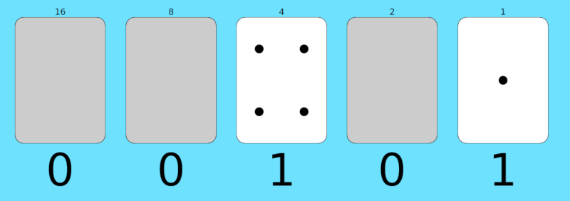

# Programiranje bez računara

Učimo osnovne programerske veštine, bez zurenja u ekran. Za uzrast od 7 do 107.

## Ideje

### Brojanje odeljenja

- Svi ustanu, i svako je broj jedan
- Podele se u parove, jedan preda svoj broj drugome i sedne
- To se nastavi dok ne ostane samo jedan da stoji, sa ukupnim brojem đaka
