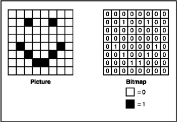

## Kako računar čuva slike?

Prosto, za svako prazno polje zapiše 0, a za popunjeno 1.

Ovako sačuvane slike se zovu bitmape. Bit označava 0 ili 1.

## Crtanje slika

Računar crta slike iz tablice brojeva. Za svaku 1 crta kockicu a za svaku 0 prazno.

<textarea id='primer'>
00111100
01000010
10100101
10000001
10100101
10011001
01000010
00111100
</textarea>

<canvas id="platno1" width="160" height="160"></canvas>

Slobodno menjaj nule i jedinice da vidiš kako se menja slika.

## Zadatak

Precrtaj kvadrat pomoću nula i jedinica.

<textarea id='unos'>
00000000
00000000
00000000
00000000
00000000
00000000
00000000
00000000
</textarea>

<canvas id="platno2" width="160" height="160"></canvas>

<button type="button" id="provera">Proveri</button> 
 
Pomoć? Treba da ima osam redova, i osam brojeva u svakom redu.

