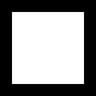

## Мапе битова

Како рачунар чува слике? Просто, за свако празно поље запише 0, а за попуњено 1. Овако сачуване слике се зову битмапе. Бит означава 0 или 1.

Такође, рачунар црта слике на основу мапе битова. За сваку јединицу црта коцкицу а за сваку нулу оставља празно.

<textarea id='primer'>
00111100
01000010
10100101
10000001
10100101
10011001
01000010
00111100
</textarea>

<canvas id="platno1" width="160" height="160"></canvas>

Слободно мењај нуле и јединице да видиш како се мења слика.

## Задатак

Прецртај квадрат помоћу нула и јединица.

<textarea id='unos'>
00000000
00000000
00000000
00000000
00000000
00000000
00000000
00000000
</textarea>

<canvas id="platno2" width="160" height="160"></canvas>



